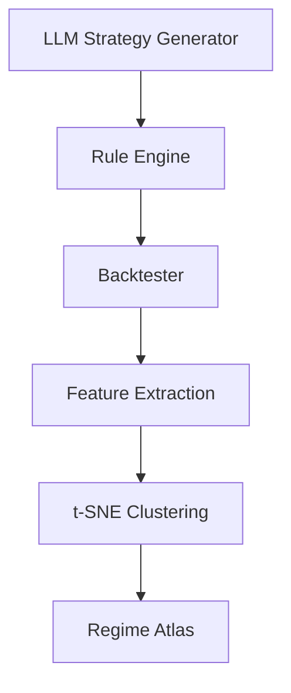

# AI Strategy Search Lab

An AI-powered quantitative research platform.

## Goal
Generate thousands of strategies, backtest across regimes, cluster survivors.

## Pipeline

## Strategy families
- Trend
- Breakout
- Mean Reversion
- Carry
- Volatility

## Frontend
- Strategy editor
- Equity curve
- Regime heatmap
- Cluster explorer

## Backend
Vectorized pandas/numpy engine with walk-forward testing.
